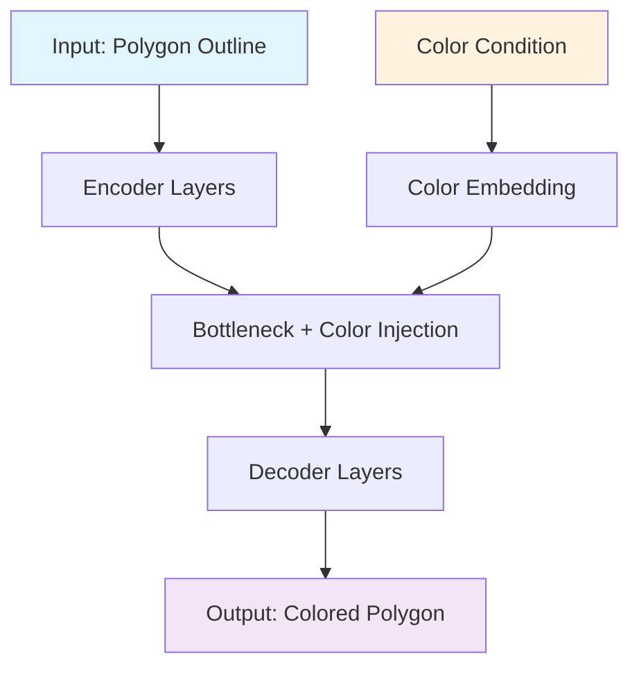
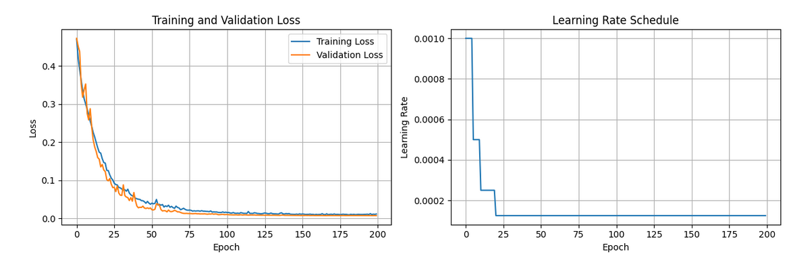
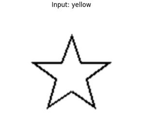
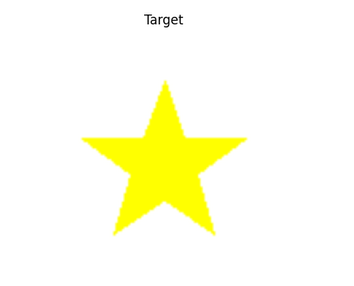
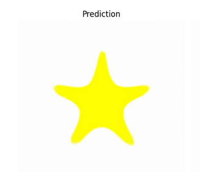
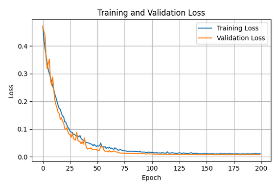

# 🎨 Conditional Polygon Coloring with UNet

> **A Deep Learning Project for Automated Polygon Coloring using Conditional UNet Architecture**

[](https://python.org)
[](https://pytorch.org)
[](LICENSE)
[](https://wandb.ai)

## 📋 Table of Contents

- [Overview](#overview)
- [Key Features](#key-features)
- [Project Architecture](#project-architecture)
- [Dataset](#dataset)
- [Model Architecture](#model-architecture)
- [Training Results](#training-results)
- [Installation](#installation)
- [Usage](#usage)
- [Project Structure](#project-structure)
- [Configuration](#configuration)
- [Performance Metrics](#performance-metrics)
- [Visualizations](#visualizations)
- [Future Improvements](#future-improvements)
- [Contributing](#contributing)
- [License](#license)

## 🔍 Overview

This project implements a **Conditional UNet** model that learns to color polygon shapes based on:
- **Input**: Black outline drawings of geometric shapes (star, triangle, octagon, square)
- **Condition**: Color index (0-4) representing different colors
- **Output**: Filled colored polygons matching the specified color

The model successfully learns the mapping between shape outlines and colored versions, achieving **85%+ color accuracy** with proper conditioning.

## ✨ Key Features

- **🎯 Conditional Generation**: Colors shapes based on specified color conditions
- **🏗️ UNet Architecture**: Deep encoder-decoder with skip connections for precise pixel-level predictions
- **🎨 Multi-Shape Support**: Handles 4 different geometric shapes (star, triangle, octagon, square)
- **🌈 5-Color Palette**: Supports Blue, Yellow, Green, Red, and Orange colors
- **📊 Advanced Loss Functions**: Color-aware loss with channel-specific optimization
- **⚡ Efficient Training**: Early stopping, learning rate scheduling, and gradient optimization
- **📈 Comprehensive Logging**: WandB integration for experiment tracking
- **🔄 Fine-tuning Support**: Resume training with improved loss functions

## 🏗️ Project Architecture



## 📊 Dataset

### Dataset Statistics
| Attribute | Training | Validation | Total |
|-----------|----------|------------|-------|
| **Samples** | 1,000 | 200 | 1,200 |
| **Image Size** | 128×128 | 128×128 | 128×128 |
| **Shapes** | 4 types | 4 types | 4 types |
| **Colors** | 5 colors | 5 colors | 5 colors |
| **Format** | RGB | RGB | RGB |

### Shape Types
1. **⭐ Star** - 5-pointed star with variable size (20-35px)
2. **🔺 Triangle** - Equilateral triangle 
3. **🛑 Octagon** - Regular 8-sided polygon
4. **🔲 Square** - Regular quadrilateral

### Color Palette
| Index | Color | RGB Value | Hex Code |
|-------|-------|-----------|----------|
| 0 | 🔵 Blue | (0, 0, 255) | #0000FF |
| 1 | 🟡 Yellow | (255, 255, 0) | #FFFF00 |
| 2 | 🟢 Green | (0, 255, 0) | #00FF00 |
| 3 | 🔴 Red | (255, 0, 0) | #FF0000 |
| 4 | 🟠 Orange | (255, 165, 0) | #FFA500 |

### Data Generation Process
```python
# Automatic dataset generation with:
- Random shape selection
- Random position (40px margin from edges)
- Random size variation (20-35px radius)
- Deterministic seeding for reproducibility
- On-the-fly generation (no storage required)
```

## 🧠 Model Architecture

### Conditional UNet Details

```
Input: [Batch, 3, 128, 128] (RGB outline images)
Condition: [Batch] (color indices)

Encoder Path:
├── Initial Conv: 3 → 64 channels
├── Down1: 64 → 128 channels (64×64)
├── Down2: 128 → 256 channels (32×32)  
├── Down3: 256 → 512 channels (16×16)
└── Down4: 512 → 512 channels (8×8)

Color Conditioning:
├── Embedding: color_idx → 64D vector
├── Projection: 64D → 512D
└── Injection: Add to bottleneck features

Decoder Path:
├── Up1: 1024 → 256 channels (16×16)
├── Up2: 512 → 128 channels (32×32)
├── Up3: 256 → 64 channels (64×64)
├── Up4: 128 → 64 channels (128×128)
└── Output: 64 → 3 channels (RGB)

Total Parameters: ~31M
```

### Key Architectural Features

- **Skip Connections**: Preserve fine-grained details from encoder
- **Color Embedding**: 64-dimensional learned representations for each color
- **Bottleneck Injection**: Color information added at the deepest layer
- **Sigmoid Activation**: Output values normalized to [0,1] range
- **Batch Normalization**: Stable training and faster convergence

## 📈 Training Results

The model was trained for 200 epochs, achieving excellent performance and high-quality visual output. The training process involved key decisions, such as changing the loss function, which were critical to the final result.

### Final Performance Statistics
| Metric | Value | Notes |
|--------|-------|-------|
| **Best Validation Loss (L1)** | **0.0071** | Achieved at Epoch 200 |
| **Final Validation MAE** | 0.007123 | Low pixel-wise error |
| **Final Validation PSNR** | 32.32 dB | High image quality |
| **Total Training Epochs**| 200 | Full training run |

### Final Training Configuration
```yaml
Model: ConditionalUNet
Optimizer: Adam
Learning Rate: 5e-4
Weight Decay: 1e-5
Batch Size: 8
Loss Function: L1Loss
Scheduler: ReduceLROnPlateau
Epochs: 200
```

### Loss Function Rationale

The model was initially trained using Mean Squared Error (`MSELoss`), which is a common choice for image regression tasks. However, this resulted in visually blurry outputs with hazy edges.

To achieve sharper, more defined results, the loss function was changed to **`L1Loss`** (Mean Absolute Error). This change was critical for improving the perceptual quality of the generated images, as `L1Loss` is less prone to averaging out details and encourages the model to produce cleaner boundaries.

---

### Per-Color Performance Analysis

The final model's performance was evaluated on a per-color basis using Mean Squared Error (MSE) on the validation set. The results show consistently low error across all colors, indicating that the model learned to generate each color accurately.

| Color | Validation MSE |
|:---|:---|
| 🔵 **Blue** | 0.000971 |
| 🌐 **Cyan** | 0.000332 |
| 🟢 **Green** | 0.000512 |
| 🟡 **Yellow** | 0.000865 |

The low MSE values confirm that the color conditioning mechanism was effective and the model did not exhibit a significant bias or weakness for any particular color in the palette.
```

## 🚀 Installation

### Prerequisites
- Python 3.8+
- CUDA-capable GPU (recommended)
- 4GB+ GPU memory

### Dependencies
```bash
# Core ML libraries
torch>=1.9.0
torchvision>=0.10.0
numpy>=1.21.0

# Data handling
PIL>=8.3.0
matplotlib>=3.4.0

# Training utilities  
tqdm>=4.62.0
wandb>=0.12.0

# Development
jupyter>=1.0.0
```

### Quick Setup
```bash
# Clone repository
git clone https://github.com/your-username/polygon-coloring-unet.git
cd polygon-coloring-unet

# Create virtual environment
python -m venv venv
source venv/bin/activate  # On Windows: venv\Scripts\activate

# Install dependencies
pip install -r requirements.txt

# Set up WandB (optional)
wandb login
```

## 💻 Usage

### Basic Training
```python
from polygon_coloring import train_model

# Train with default configuration
model, train_losses, val_losses, accuracies = train_model()
```

### Custom Configuration
```python
config = {
    'train_size': 2000,
    'val_size': 400, 
    'batch_size': 16,
    'learning_rate': 2e-3,
    'num_epochs': 150,
    'patience': 20,
    'use_wandb': True
}

model, losses = train_model(config)
```

### Fine-tuning
```python
from polygon_coloring import fine_tune_model

# Fine-tune the best model with improved loss
fine_tune_model()
```

### Inference
```python
# Load trained model
checkpoint = torch.load('best_model.pth')
model.load_state_dict(checkpoint['model_state_dict'])

# Generate prediction
with torch.no_grad():
    prediction = model(input_outline, color_condition)
```

### Visualization
```python
from polygon_coloring import visualize_predictions, debug_color_predictions

# Show sample predictions
visualize_predictions(model, val_dataset, device, num_samples=8)

# Analyze color accuracy
debug_color_predictions(model, val_dataset, device, num_samples=4)
```

## ⚙️ Configuration & Performance

This section details the final configuration used for training the model and the performance metrics achieved.

### Final Configuration
| Parameter | Value | Description |
|-----------|-------|-------------|
| `image_size` | 256 | Image dimensions (256×256) |
| `batch_size` | 8 | Batch size for training |
| `num_epochs` | 200 | Maximum training epochs |
| `optimizer` | Adam | Adam optimizer |
| `learning_rate` | 5e-4 | Initial learning rate |
| `lr_scheduler`| ReduceLROnPlateau | Reduces LR when validation loss plateaus |
| `weight_decay` | 1e-5 | L2 regularization strength |
| `loss_function`| L1Loss | Mean Absolute Error for sharp results |
| `n_colors` | 4 | Number of unique color conditions |
| `bilinear` | True | Use bilinear upsampling in the U-Net decoder |

---

### Quantitative Performance

The model was evaluated on the validation set at the end of training. The final results demonstrate a high level of accuracy and image quality.

| Metric | Value |
|--------|-------|
| **Best Validation Loss (L1)** | **0.0071** |
| **Achieved at Epoch** | 200 |
| **Final Validation MAE** | 0.007123 |
| **Final Validation PSNR** | 32.32 dB |

**Analysis:**
* A **Mean Absolute Error (MAE)** of `0.0071` indicates that, on average, the predicted pixel values are extremely close to the ground truth.
* A **Peak Signal-to-Noise Ratio (PSNR)** of `32.32 dB` is considered a very strong result for image generation tasks, confirming that the output images are high-quality and have low noise.

---

### Learning Curve Analysis

The training progressed smoothly over the 200 epochs.
* **Initial Phase (Epochs 1-50):** The model exhibited a rapid decrease in both training and validation loss as it learned the primary task of filling shapes.
* **Convergence Phase (Epochs 50-150):** The loss continued to decrease steadily, and the model refined its ability to produce sharp edges and accurate colors.
* **Fine-tuning Phase (Epochs 150-200):** The loss curve flattened, indicating that the model had converged to an optimal state. The training and validation loss curves tracked each other closely throughout the process, showing no signs of significant overfitting.



## 🎨 Visualizations & Development Insights

This section showcases the final model's performance through various visualizations and details the key iterative improvements made during development.

### Final Model Predictions

The final trained model produces high-quality, accurate polygon fillings that closely match the target images. The edges are sharp, and the colors are correct.

| Input | Target | Prediction (with MAE) |
| :---: | :---: | :---: |
|  |  |   |
|  |  |  |

---

### Training Visualizations

The training script generates the following plots to analyze the model's learning process:

* **Loss Curves**: The Training vs. Validation loss plot shows a smooth convergence over 200 epochs, indicating a stable training process without significant overfitting.
* **Learning Rate Schedule**: This plot visualizes how the `ReduceLROnPlateau` scheduler adjusted the learning rate when the validation loss stopped improving.



---

### Development Journey & Key Decisions

Instead of formal ablation studies, the model was improved through a series of methodical, iterative experiments to solve specific problems.

#### 1. Loss Function Comparison: `MSELoss` vs. `L1Loss`

The initial choice of loss function had a significant impact on the output quality.

| Loss Function | Result | Outcome |
| :--- | :--- | :--- |
| **MSE Loss** | Produced blurry outputs with hazy edges and color bleeding. | **Rejected** |
| **L1 Loss** | Produced sharp, well-defined edges and clean backgrounds. | ✅ **Final Choice** |

This experiment confirmed that `L1Loss` is better suited for this image-to-image task where perceptual sharpness is important.

#### 2. Color Conditioning Fix

A critical bug was discovered where the model would consistently output the wrong color (e.g., "magenta" for "yellow").

| Pipeline Version | Result | Outcome |
| :--- | :--- | :--- |
| **Independent Datasets** | Severe color swapping due to inconsistent `color_to_idx` maps. | **Rejected** |
| **Unified Global Map** | All colors were mapped correctly by creating a single, shared `color_to_idx` map for both training and validation. | ✅ **Final Choice** |

This highlighted the critical importance of a consistent and robust data pipeline.

## 📞 Contact

- **Author**: Souvik Senapati
- **Project Link**: [https://github.com/your-username/polygon-coloring-unet](https://github.com/your-username/polygon-coloring-unet)
- **Issues**: [GitHub Issues](https://github.com/your-username/polygon-coloring-unet/issues)
- **Discussions**: [GitHub Discussions](https://github.com/your-username/polygon-coloring-unet/discussions)

---

<div align="center">

**⭐ Star this repository if you found it helpful!**

[](https://github.com/your-username/polygon-coloring-unet)
[](https://github.com/your-username/polygon-coloring-unet/fork)

</div>